## Project: Build a Traffic Sign Recognition Program

Overview
---
In this project, you will use what you've learned about deep neural networks and convolutional neural networks to classify traffic signs. You will train and validate a model so it can classify traffic sign images using the [German Traffic Sign Dataset](http://benchmark.ini.rub.de/?section=gtsrb&subsection=dataset). After the model is trained, you will then try out your model on images of German traffic signs that you find on the web.

### Proposed solution

We begin with a simple exploratory analysis of the training data set. There are a little less than 52k images, split into training, validation and test sets.

Our traffic signs belong to 43 different classes and image 1 below shows the distribution of our training set:

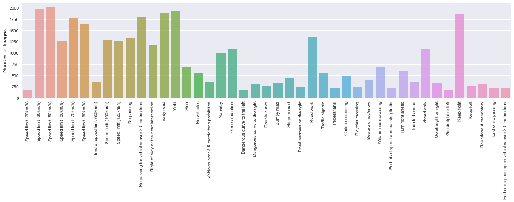

The next step was to plot random images for the classes that were most and least represented, this would give us an idea of what kind of problems to expect down the road.

The three classes that have the least amount of training images are as follows:

- Speed limit (20 km/h)

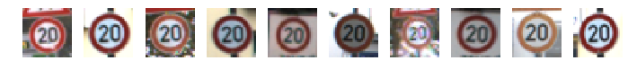

- Go straight or left

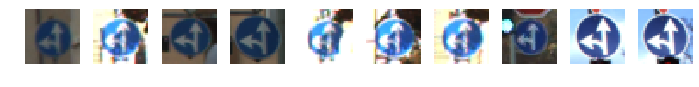

- Dangerous curve to the left

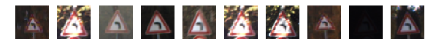

And the three most represented classe are:

- Speed limit (50 km/h)

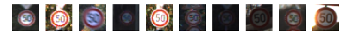

- Speed limit (30 km/h)

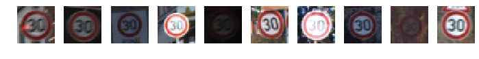

- Yield

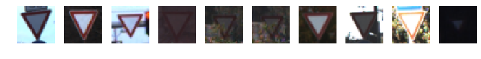

### Preprocessing

As we can see, the quality of the images are very different one from another, this will certainly impact our model if we are not careful with the preprocessing of these images.

On [1] the winners of the GTSRB challenge addressed this problem by normalizing the contrast during preprocessing.

On [2] the authors introduced more samples to the training dataset by applying translations, scaling and rotations during preprocessing.

We will follow their award winning approach to preprocessing before moving on to our model architecture, and although the authors of [1] used color images to win the challenge, the authors of [2] did not see any significant improvement in using color as part of their pipeline.

Based on the results of [1] and [2], I decided to convert the images to gray scale and then apply [Adaptive Histogram Equalization](https://en.wikipedia.org/wiki/Adaptive_histogram_equalization)
.

You can see the results of preprocessing on the set of images below:

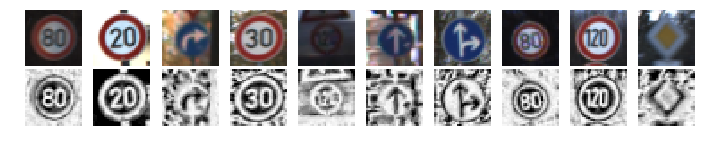

### Model architecture

I thought that the problem that was provided was a very interesting opportunity to put the famous, but already aging, LeNet-5 [4] against more modern techniques in Deep Learning. I am going to first run a LeNet-5 model on the preprocessed dataset, then we will see the impact of data augmentation on this exact same model and lastly I will put it against a more modern CNN with some great new tools that were developed in the last few years.

#### Benchmark: LeNet-5 (Validation Accuracy: 96%)

This is how we implemented our LeNet-5 model:

- Input(32, 32, 3 or 32, 32, 1 - depending on whether you are passing on color or gray scale images)

- Convolution (Kernel: 5x5, Depth: 6, Stride: 1)
- Relu
- Maxpool (Kernel: 2x2, Stride: 2)

- Convolution (Kernel: 5x5, Depth: 16, Stride: 1)
- Relu
- Maxpool (Kernel: 2x2, Stride: 2)

- Flatten
- Fully Connected layer (Size: 120, activation: Relu)
- Fully Connected layer (Size: 84, activation: Relu)
- Softmax (n_classes = 43)

Training parameters:
- Optimizer: Adam
- Learning rate: 1e-3
- L2 regularization: 1e-3
- Batch size: 64
- Epochs: 200
- Early stopping: 100

Using 200 epochs was definitely an overkill, but this model is cheap to run and the early stopping rule was there to protect us from over-fitting.

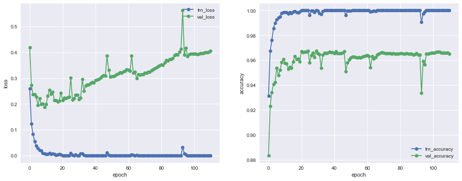

We see that the model started to overfit pretty quickly, and our early stopping safeguard kept the results from Epoch 9 as our best fit for the validation dataset.

Trying to improve the results a little bit, I reduced the learning rate to 1e-4 and 1e-5 (shown on the picture below) and ran it again, with the exact same hyperparameters as before.

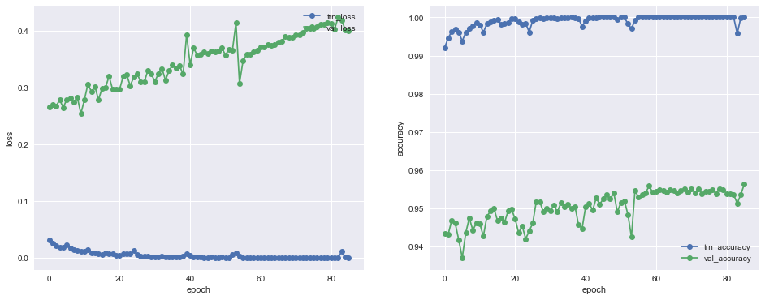

But it was still keen to over-fitting and there were no improvements. I have also experimented with a stronger L2 regularization but the overall results were not any better.

#### Data Augmentation: +2%

For this part I created a function that will randomly rotate, scale and translate our images with the same parameters as implemented in [2]

Sermanet and LeCun also suggested that their model could perform better if they added some Real-world deformations, such as motion blur and shape deformations. So I decided to add them to our pipeline as well.

- Rotation between -15 and 15 degrees
- Scaling between 0.9 and 1.1
- Translation between -2 and 2 pixels

I have also added a shear transformation and motion blur as suggested by the authors at the summary of their work. The parameters for this new transformations are:

- Shear limit between -10 and 10 degrees
- Motion blur kernel size of 3 pixels

The images below show a comparison between the original image, a color version with histogram equalization, a rotated image, another one with motion blur and the last is using the function to randomly apply all of the above.

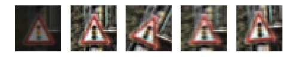
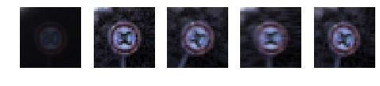

We used these transformations to create a dataset that is 7x larger than the original dataset. At this point we could have also used this opportunity to better balance our classes, but thinking that the observation rate of our sample could be similar to what we expect to find in the streets of Germany, I decided to not explore this route.

Our results were pretty impressive and we achieved 98% accuracy on a model that's about to turn 20 years old. Over-fitting was significantly reduced as can be seen in the image below.

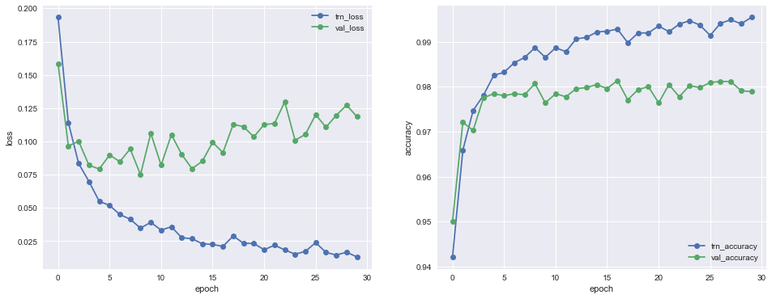

Fine tuning with lower learning rates once again provided no improvement to the model.

A better early stopping and fine tuning approach can probably increase the 98% accuracy shown here, but I am not sure by how much. This result is close to what Sermanet and LeCun [2] achieved during the first phase of the actual GTSRB competition with their lowest performing models.

#### Modern CNNs: Better than average human performance.

The results above are certainly interesting and almost on par with human performance and they were achieved using an architecture from 1998! Since then there were many new developments in the field and inspired by the great results shown by some other students [5] and [6], I would like to draw a comparison between the performance of LeNet-5 and more modern convnets architectures.

To showcase the power of recently developed tools I put together a model that has 3 blocks that are built as follows:

- Convolution (Kernel: 3x3, Stride: 1)
- Batch Normalization
- Relu
- Convolution (Kernel: 3x3, Stride: 1)
- Batch Normalization
- Relu
- Convolution (Kernel: 2x2, Stride: 2) - This replaces the maxpooling layer
- Dropout (p: 0.2)

After each block the size of the input is halved, but the depth of the convolutions double.

Here is the full model architecture:

- Input(32, 32, 3 or 32, 32, 1 - depending on whether you are passing on color or gray scale images)

- Convolution (Kernel: 3x3, Depth: 32, Stride: 1)
- Batch Normalization
- Relu
- Convolution (Kernel: 3x3, Depth: 32, Stride: 1)
- Batch Normalization
- Relu
- Convolution (Kernel: 2x2, Depth: 32, Stride: 2)
- Dropout (p: 0.2)

- Convolution (Kernel: 3x3, Depth: 64, Stride: 1)
- Batch Normalization
- Relu
- Convolution (Kernel: 3x3, Depth: 64, Stride: 1)
- Batch Normalization
- Relu
- Convolution (Kernel: 2x2, Depth: 64, Stride: 2)
- Dropout (p: 0.2)

- Convolution (Kernel: 3x3, Depth: 128, Stride: 1)
- Batch Normalization
- Relu
- Convolution (Kernel: 3x3, Depth: 128Stride: 1)
- Batch Normalization
- Relu
- Convolution (Kernel: 2x2, Depth: 128Stride: 2)
- Dropout (p: 0.2)

- Flatten
- Fully Connected layer (Size: 512, activation: Relu)
- Dropout (p: 0.5)
- Softmax (n_classes = 43)

I believe this is a good selection of most of the important techniques that have been adopted by the industry.

I have also decided to keep the structure of the NN on a conventional way, I believe this will have an impact on our prediction capabilities as the best results I've seen out there are following the same approach as in [2], but by keeping our model with a similar form as the one from LeNet we can more accurately compare the performance between these two models.

I intentionally left out Inception and Residual Neural Net modules as the intent of this study is to compare "similarly" constructed networks, although they would certainly perform better than our proposed model.

In the references section of the notebook you will find links to all of the sources that inspired this study.

###### Batch Normalization
One of many benefits of Batch Normalization is that it also allows for larger learning rates. We will start with a learning rate 10x larger than the one we used in our LeNet 5 implementation above, but to avoid having to run a training and a fine tuning step I am also implementing a learning rate decay function that will divide our learning rate by 10 every 10 epochs.

###### Training
The model was trained with a slight different approach this time. It was trained for 30 epochs using SGD with Nesterov Momentum (m = 0.9), the batch size used was the same as for LeNet, 64 samples.

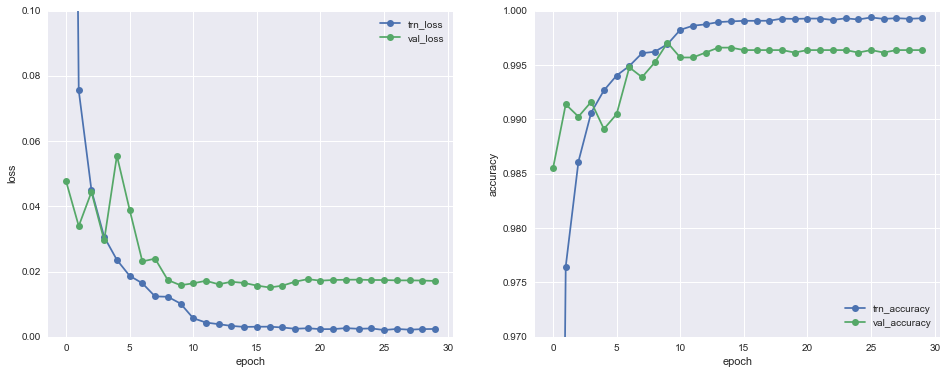

The validation accuracy of our model was 99.6%, better than the accuracy of the average person.

Finally we get to see how our model is doing in the test set, but surprisingly the accuracy dropped, quite a lot, to 97.9%.

It's usually the case that your model will perform better on the validation set because your model was optimized to give you the best result possible with that set of data in mind.

Getting your model to generalize well is one of the most difficult parts of tuning it, but further exploring what went wrong will give us important information as to how to improve our prediction power.

### Error Analysis

The confusion matrix below will help us in identifying what are the classes that are being misclassified the most and against which other classes.

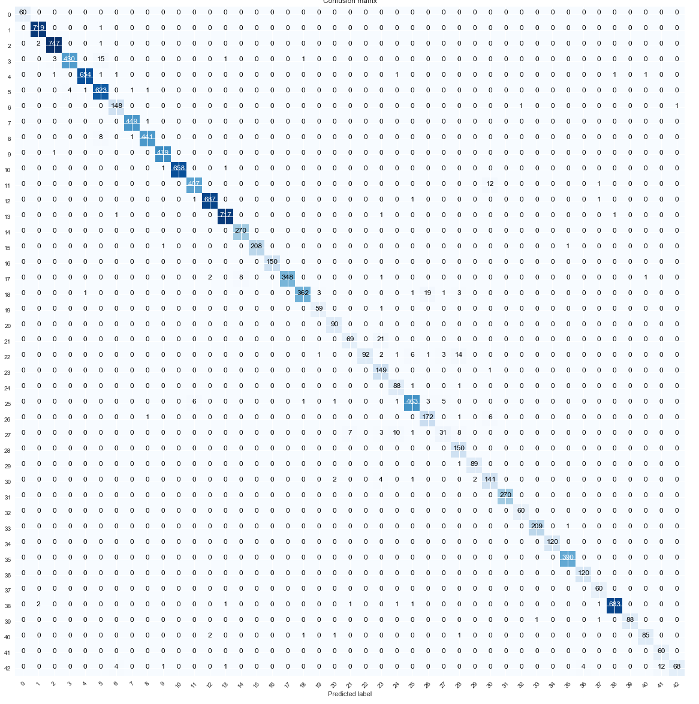

So class 3 was mostly confused with class 5, class 18 with 27, 21 and 23, 22 and 28, 27 with 23 and 28 and class 42 was mostly mistaken to be class 41.

We will plot again a few examples of these classes side by side to see if it gives us any hints as to why we are misclassifying them.

1) Speed limit (60km/h) confused with Speed limit (80km/h):

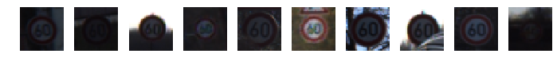
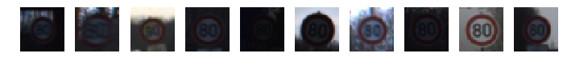

2) General caution confused with Pedestrians:

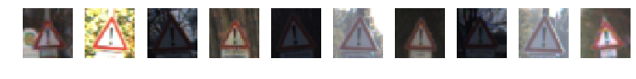
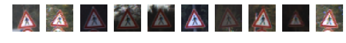

3) Double curve confused with Slippery road:

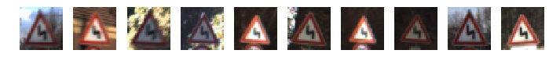
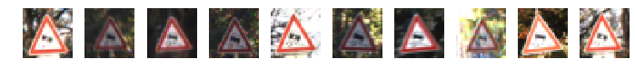

4) Bumpy road confused with Children crossing:

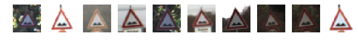
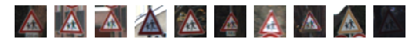

5) Pedestrians confused with Slippery road and Children crossing:

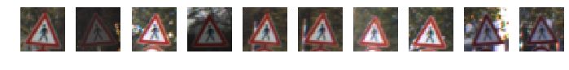
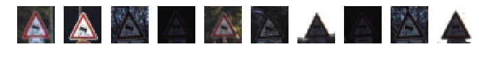
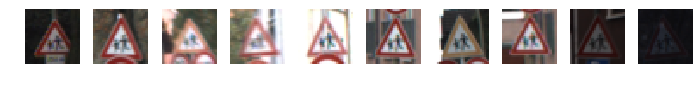

6) End of no passing by vehicles over 3.5 metric tons confused with End of no passing:

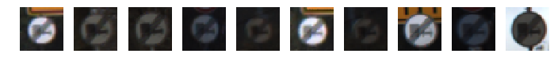
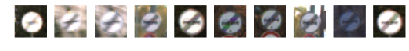

It's interesting to see that most mistakes happened with signs that are very similar in form, and although slippery road was confused with bumpy road (both have blobs inside the sign) it wasn't confused with pedestrians or double curve (they have lines inside the sign).

This may be one of the reasons why our model is under performing the work done by [5] and [6]. When we chose a more common NN approach without feature sharing, we told the network to only worry about the features as extracted by the top of our network, while the other approach allows the model to pick and choose from a wider set of features as to which would be more relevant to further differentiate between those classes.

#### Testing on 5 new images

With the limitations of our network in mind I chose the new test set to be on those cases where we already know that the model is not doing well. It may give us insights as to how bad we are actually doing and see if there is a solution not as drastic as redesigning the whole network architecture.

The image below shows the 5 new images along with their preprocessed versions.

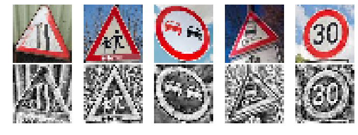

As expected we didn't do too well on this limited sample, only 60% accuracy, compared with a 97.9% on the test set. But that's fine, they were chosen to be difficult for the model to classify. The idea of this sample was to give us more information about where are are getting things wrong.

Looking at the top 5 probabilities will show us how certain, or uncertain, the model was on these two misclassification cases.

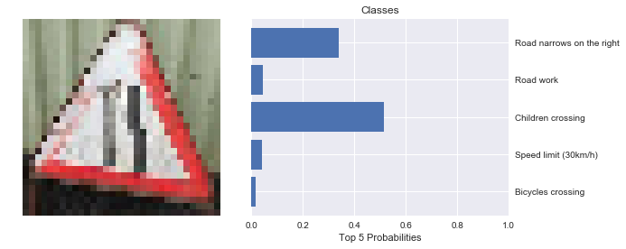

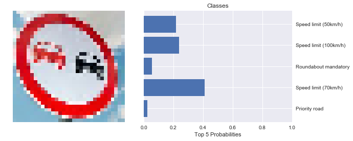

We can see that in the first case our model was actually in doubt between the correct class and one alternative, while on the second one the model had no clue what that sign was and was in doubt amongst several speed limit signs, that have the same shape.

What is interesting is that the No passing is a class that has a very good representation on our training set and according to our confusion matrix (class 9) is one the model is usually right about. The preprocessing of that image seems to be ok, at least visually, but these were low resolution images downloaded from the web, so this could have impacted the performance.

References
---

[1] [Multi-Column Deep Neural Network for Traffic Sign
Classification](http://people.idsia.ch/~juergen/nn2012traffic.pdf)

[2] [Traffic Sign Recognition with Multi-Scale Convolutional Networks](http://yann.lecun.com/exdb/publis/pdf/sermanet-ijcnn-11.pdf)

[3] [What is the Best Multi-Stage Architecture for Object Recognition?](http://yann.lecun.com/exdb/publis/pdf/jarrett-iccv-09.pdf)

[4] [Gradient-Based Learning Applied to Document Recognition](http://yann.lecun.com/exdb/publis/pdf/lecun-98.pdf)

[5] [Traffic signs classification with a convolutional network](http://navoshta.com/traffic-signs-classification/)

[6] [Updated! My 99.68% solution to Udacity Nanodegree project P2 (Traffic Sign Classification)](https://medium.com/@hengcherkeng/updated-my-99-68-solution-to-udacity-nanodegree-project-p2-traffic-sign-classification-56840768dec8)

[7] [Deep Residual Learning for Image Recognition](https://arxiv.org/pdf/1512.03385.pdf)

[8] [Inception-v4, Inception-ResNet and the Impact of Residual Connections on Learning](https://arxiv.org/pdf/1602.07261.pdf)

[9] [Tensorflow Models - Resnet](https://github.com/tensorflow/models/tree/master/resnet)

[10] [Keras-resnet](https://github.com/raghakot/keras-resnet)

[11] [Resnet-like network using full-preactivation](https://gist.github.com/JefferyRPrice/c1ecc3d67068c8d9b3120475baba1d7e)

[12] [CS231n: Convolutional Neural Networks for Visual Recognition](http://cs231n.github.io/convolutional-networks/)

[13] [Batch Normalization: Accelerating Deep Network Training by Reducing Internal Covariate Shift](https://arxiv.org/pdf/1502.03167.pdf)

[14] [Striving For Simplicity: The All Convolutional Net](https://arxiv.org/pdf/1412.6806.pdf)

[15] [Understanding the difficulty of training deep feedforward neural networks](http://jmlr.org/proceedings/papers/v9/glorot10a/glorot10a.pdf)

[16] [Dropout: A Simple Way to Prevent Neural Networks from Overfitting](http://www.jmlr.org/papers/volume15/srivastava14a.old/source/srivastava14a.pdf)

[17] [Keras Tutorial - Traffic Sign Recognition](https://chsasank.github.io/keras-tutorial.html)
